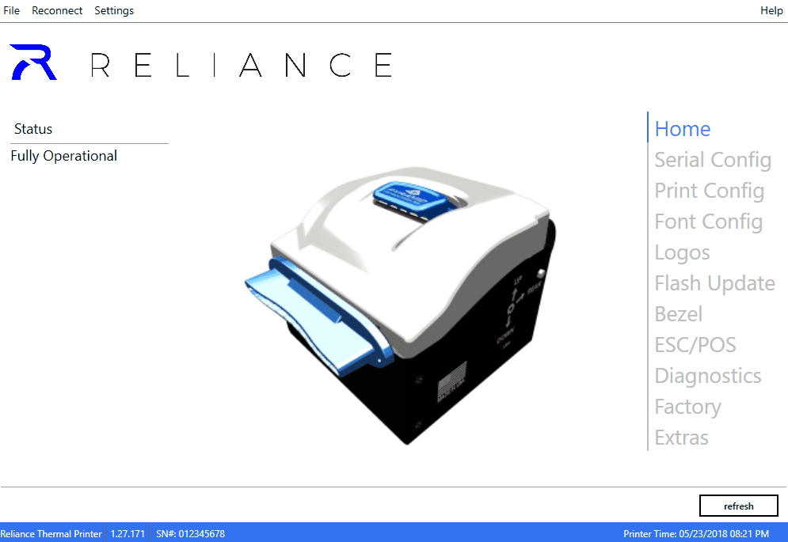

# Device Configuration

Configuration can be managed through this API with use of Reliance RFG
configuration files. The workflow for generating this files is to use
Reliance Tools for PC to configure your printer to your desired settings.
When ready, click File->Save Config and select where to save your file.
The file will have the RFG file extension.

## Getting a Config

## Code
Once you have an RFG file, you have a few options for getting it into your application.
The most straightforward method is to use <xref:PTIRelianceLib.BinaryFile.From*>.

## Code Sample
[!code-csharp[Main](Sample_03.cs)]

[!include[<Exceptions>](<exceptions.md>)]