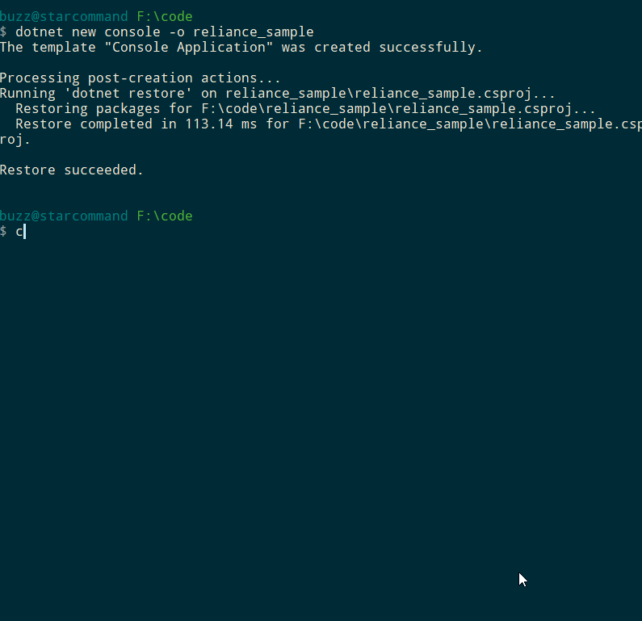

# Getting Started

1. Install [.NET Core](https://www.microsoft.com/net/download/windows) for your operating system
2. Open your favorite terminal
3. Execute
```
dotnet new console -o reliance_sample 
cd reliance_sample
dotnet add package PTIRelianceLib
```
4. Open Program.cs in your favorite editor and replace the code with the following:
[!code-csharp[Main](Sample_01.cs)]

> [!IMPORTANT]
> Linux users, please make sure libusb is installed before proceeding

5. Execute
```
dotnet run
```

## Results
